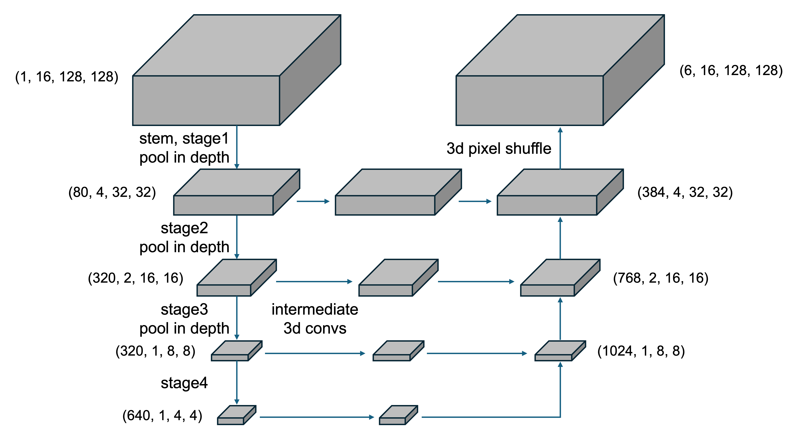

# CZII - CryoET Object Identification - 4th Place Solution
This is the implementation of the 4th place solution (yu4u's part) for [CZII - CryoET Object Identification](https://www.kaggle.com/competitions/czii-cryo-et-object-identification) at Kaggle.
The source code for tattaka's model can be found [here](https://github.com/tattaka/czii-cryo-et-object-identification-public).
The overall solution is described in [this discussion](https://www.kaggle.com/competitions/czii-cryo-et-object-identification/discussion/561401).

Our technical paper is also [available](https://arxiv.org/abs/2502.13484).



## Requirements
- 10GB > VRAM (trained on GeForce RTX 3090 in my case).

## Preparation
- Download the competition dataset from [here](https://www.kaggle.com/competitions/rsna-2024-lumbar-spine-degenerative-classification/data) and put them in `input` directory.
    ```shell
    unzip czii-cryo-et-object-identification.zip -d input
    ```
- Install Docker/NVIDIA Container Toolkit.
- Build the Docker image and enter the Docker container:
    ```shell
    export UID=$(id -u)
    docker compose up -d
    docker compose exec dev /bin/bash
    ```
- Login to wandb:
    ```shell
    wandb login
    ```

## Training Process

```sh
# prepare dataset
python 01_create_dataset.py

# create ground-truth heatmap
python 02_create_mask.py --class_num 6

# create ground-truth solution for validation
python 03_create_solution.py

# train models, required 3.5 hours per fold on GeForce RTX 3090 x 1
python 11_train.py trainer.accelerator=gpu trainer.devices=[0] data.batch_size=32 trainer.precision=16 data.num_workers=8 trainer.max_epochs=64 wandb.name=timm3d3_convnext_nano_class6_fold2 opt.lr=1e-3 opt.opt=AdamW opt.weight_decay=0 scheduler.min_lr=0 model.img_depth=16 model.img_size=128 model.arch=timm3d3 model.ema=True model.ema_decay=0.999 model.in_channels=5 loss.mixup=0.5 model.backbone=convnext_nano.in12k_ft_in1k scheduler.warmup_epochs=4 model.class_num=6 trainer.deterministic=warn data.fold_id=2
python 11_train.py trainer.accelerator=gpu trainer.devices=[0] data.batch_size=32 trainer.precision=16 data.num_workers=8 trainer.max_epochs=64 wandb.name=timm3d3_convnext_nano_class6_fold3 opt.lr=1e-3 opt.opt=AdamW opt.weight_decay=0 scheduler.min_lr=0 model.img_depth=16 model.img_size=128 model.arch=timm3d3 model.ema=True model.ema_decay=0.999 model.in_channels=5 loss.mixup=0.5 model.backbone=convnext_nano.in12k_ft_in1k scheduler.warmup_epochs=4 model.class_num=6 trainer.deterministic=warn data.fold_id=3
python 11_train.py trainer.accelerator=gpu trainer.devices=[0] data.batch_size=32 trainer.precision=16 data.num_workers=8 trainer.max_epochs=64 wandb.name=timm3d3_convnext_nano_class6_fold4 opt.lr=1e-3 opt.opt=AdamW opt.weight_decay=0 scheduler.min_lr=0 model.img_depth=16 model.img_size=128 model.arch=timm3d3 model.ema=True model.ema_decay=0.999 model.in_channels=5 loss.mixup=0.5 model.backbone=convnext_nano.in12k_ft_in1k scheduler.warmup_epochs=4 model.class_num=6 trainer.deterministic=warn data.fold_id=4
python 11_train.py trainer.accelerator=gpu trainer.devices=[0] data.batch_size=32 trainer.precision=16 data.num_workers=8 trainer.max_epochs=64 wandb.name=timm3d3_convnext_nano_class6_fold6 opt.lr=1e-3 opt.opt=AdamW opt.weight_decay=0 scheduler.min_lr=0 model.img_depth=16 model.img_size=128 model.arch=timm3d3 model.ema=True model.ema_decay=0.999 model.in_channels=5 loss.mixup=0.5 model.backbone=convnext_nano.in12k_ft_in1k scheduler.warmup_epochs=4 model.class_num=6 trainer.deterministic=warn data.fold_id=6
```

Trained models are saved in `saved_models/timm3d3_convnext_nano_class6_fold[2|3|4|6]` directories.
Our checkpoint can be found [here](https://www.kaggle.com/datasets/ren4yu/czii-models8).
Convert these checkpoints into TensorRT engines using [this notebook](https://www.kaggle.com/code/ren4yu/czii-tensorrt-convert-1/notebook).
The outputs from this notebook can be used in [the submission notebook](https://www.kaggle.com/code/ren4yu/czii-ensemble-tensorrt-xy-stride-th?scriptVersionId=220758003).

## Citation

```bibtex
@article{uchida2025unet,
  title={2.5D U-Net with Depth Reduction for 3D CryoET Object Identification},
  author={Uchida, Yusuke and Fukui, Takaaki},
  journal={arXiv preprint arXiv:2502.13484},
  year={2025}
}
```
